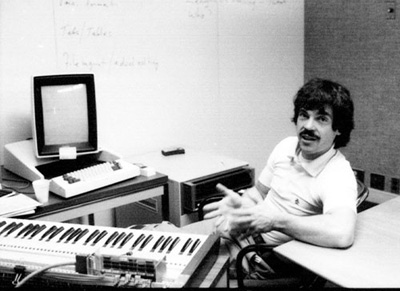

## 關於STEM的理解

STEM實際上是四個不同的領域，但是相輔相成。

# Science 

S是科學, 主要強調科學方法，思維和概念。 其核心是實驗，觀察和證偽。 現在偽科學在國內和國外都很流行。 大家都有目共睹.

# Technology
T是技術，就是人類創造的工具和系統，增強人類作為一個集體和自然交互的能力。
比如我們現在能隔著半個地球，時差12小時，通過不同的電子終端交流討論，就是人類技術的奇跡。

# Engineering 
E是工程。是人類集體合作解決問題的系統方法和實踐。 蓋房子是工程，登月是工程，互聯網是工程。
現代工程的發展的確是人類集體合作的一個奇跡。

# Math

M是數學。 也就是抽象思維和邏輯。 這是所有工程技術科學發展的真實核心。 數學保證了人類知識的可靠性和延續發展性。 改變了人類看世界的角度。 我們比牛頓之前的人沒有聰明多少，但是微積分讓我們每一個人都比牛頓前的人智商都高，這就是視角的重要性。

一位著名的學者（Alan Kay) 有一句名言：好的視角可以增加80個IQ。

- Alan Kay的遠見 [A personal Computer for Children of All Ages](Kay72a.pdf) (PDF)

- 41年以後的現實 [Afterword: What is a Dynabook?](hc_what_Is_a_dynabook.pdf) (PDF) 

# STEM

所以STEM教育的核心不是知識積累，而是思維方式和工作方式的訓練。
這不是抽象的教育，而是人類近代百年來進步的總結。

# STEAM

STEM + A = [STEAM](../STEAM)

# 隨筆

- [As We May Think (如我們所思)](../as_we_may_think)
- [從印刷術到3D打印](../3D)
- [Git和開放式創新實踐共享](../git)
